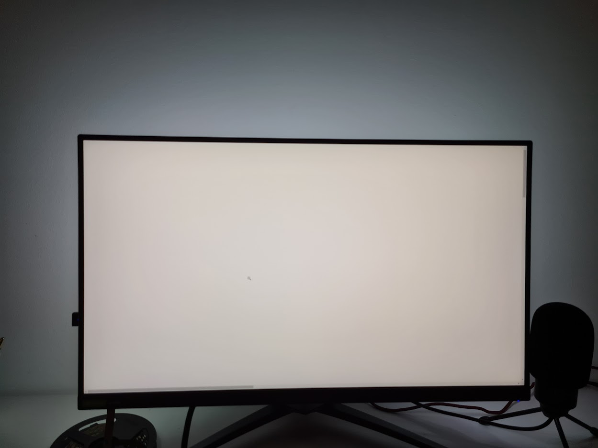

# YAAmbiC
Yet Another Ambilight Clone. Many did it before, many will do it after, this is how I did it

## Setup
Hardware:
- Ws2812b LED Strip from amazon
- esp8266

The LEDs require 5V DC, using a reasonably sized screen and appropriate brightness a USB3 outlet should be able to power this.

*EDIT* After changing the LED count from 60 to 144 using USB to power the thing is not possible anymore

Communication is done via UDP over Wifi to avoid using a Serial to USB adapter.
The color information is calculated by a python script, applying some smoothing before sending.

## Communication
The esp is connected to wifi and recieves color information via UDP. UDP avoids any overhead and is fine to use here since robustness is not a big concern.
Conveniently rgb values are encoded as a triple of bytes as the individual values range from 0-255 anyway, thus avoiding string encoding overhead.

## Screencap
Screencapture is done using https://pypi.org/project/d3dshot/, a fast screencap library.
After screencapture the image is cropped to the borders and filtered.
This method achieves ~60 fps.

## Calibration
Most RGB strips dont display perfect white at 255 255 255. This needs to be calibrated, for me the best values seem to be 200 255 100. This varies from product to product, adjust the calibration by displaying a white picture on your screen and checking if the backlight matches.

  |  
:-------------------------:|:-------------------------:
Before calibration           |  After calibration

## HomeAssistant
The MQTT interface makes the devices usable as a normal light source in HomeAssistant.
Currently there are 2 modes implemented.
- RGB Mode: Displays the selected color uniformly

- Ambient Mode: Listens for UDP messages containing colors

It can be added throught the following addition to the configuration.yaml file:

    light:                                                                      
      - platform: mqtt                                                          
        schema: json                                                            
        name: mqtt_ambient_1                                                    
        state_topic: "light/ambient1"                                           
        command_topic: "light/ambient1/set"                                     
        brightness: true                                                        
        rgb: true                                                               
        effect: true                                                            
        effect_list: ["rgb", "ambient"]
    

